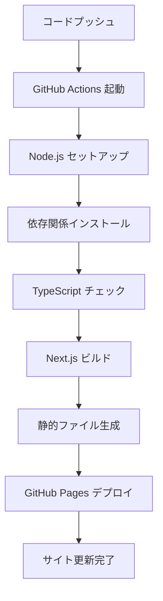

# デプロイメント

## 🚀 GitHub Pages デプロイ

### 自動デプロイ設定

#### GitHub Actions ワークフロー
```yaml
# .github/workflows/deploy.yml
name: Deploy to GitHub Pages

on:
  push:
    branches: [ main ]

jobs:
  build-and-deploy:
    runs-on: ubuntu-latest
    
    permissions:
      contents: read
      pages: write
      id-token: write
    
    steps:
    - name: Checkout
      uses: actions/checkout@v4

    - name: Setup Node.js
      uses: actions/setup-node@v4
      with:
        node-version: '20'
        cache: 'npm'

    - name: Install dependencies
      run: npm ci

    - name: Build
      run: npm run build

    - name: Setup Pages
      uses: actions/configure-pages@v4

    - name: Upload artifact
      uses: actions/upload-pages-artifact@v3
      with:
        path: './out'

    - name: Deploy to GitHub Pages
      id: deployment
      uses: actions/deploy-pages@v4
```

### Next.js 設定

#### next.config.js
```javascript
/** @type {import('next').NextConfig} */
const nextConfig = {
  reactStrictMode: true,
  trailingSlash: true,
  images: {
    unoptimized: true // GitHub Pages対応
  },
  // 静的エクスポート用の設定
  output: 'export',
  // Turbopack設定
  turbopack: {
    // 最適化設定
  }
}

module.exports = nextConfig
```

#### package.json スクリプト
```json
{
  "scripts": {
    "dev": "next dev",
    "build": "next build",
    "start": "next start",
    "lint": "next lint"
  }
}
```

## 🔧 ビルドプロセス

### 1. 依存関係のインストール
```bash
npm ci
```
- `npm install` より高速で確実
- package-lock.json を厳密に使用
- CI/CD環境に最適

### 2. TypeScript コンパイル
```bash
# 自動実行される
tsc --noEmit
```
- 型チェックの実行
- エラーがあればビルド停止
- 型安全性の保証

### 3. Next.js ビルド
```bash
npm run build
```
- 静的ファイルの生成
- JavaScript/CSS の最適化
- 画像の最適化（無効化済み）

### 4. 静的ファイル出力
```bash
# next build で自動実行
next export
```
- `/out` ディレクトリに出力
- GitHub Pages 対応形式
- SPA として動作

## 📁 出力ファイル構造

```
out/
├── index.html              # メインページ
├── _next/
│   ├── static/
│   │   ├── css/           # スタイルファイル
│   │   └── js/            # JavaScriptファイル
│   └── ...
├── favicon.svg             # ファビコン
├── apple-touch-icon.png    # Apple Touch Icon
└── .nojekyll              # Jekyll無効化
```

## 🌐 GitHub Pages 設定

### リポジトリ設定
1. **Settings** > **Pages** に移動
2. **Source** を "GitHub Actions" に設定
3. **Custom domain** (オプション)
4. **Enforce HTTPS** を有効化

### .nojekyll ファイル
```bash
# public/.nojekyll
# Jekyll処理を無効化してNext.jsファイルを正常表示
```

### カスタムドメイン (オプション)
```
# public/CNAME
your-custom-domain.com
```

## 🔄 CI/CD パイプライン

### トリガー条件
- `main` ブランチへのプッシュ
- プルリクエストのマージ
- 手動実行（workflow_dispatch）

### ビルド環境
- **OS**: Ubuntu Latest
- **Node.js**: 20.x (LTS)
- **npm**: 最新版
- **キャッシュ**: npm キャッシュ有効

### デプロイフロー


## 📊 パフォーマンス最適化

### ビルド最適化
```javascript
// next.config.js での最適化
const nextConfig = {
  // 本番環境での最適化
  swcMinify: true,
  
  // 画像最適化（GitHub Pages用に無効化）
  images: {
    unoptimized: true
  },
  
  // 静的エクスポート
  output: 'export',
  
  // トレイリングスラッシュ
  trailingSlash: true
}
```

### CSS最適化
- 未使用CSSの削除
- CSS Minification
- Critical CSS の抽出

### JavaScript最適化
- Tree Shaking
- Code Splitting
- Bundle Size 最適化

## 🔍 デプロイ検証

### 自動チェック項目
- [ ] TypeScript コンパイル成功
- [ ] ESLint チェック通過
- [ ] ビルド成功
- [ ] 静的ファイル生成完了
- [ ] GitHub Pages デプロイ成功

### 手動チェック項目
- [ ] サイトが正常に表示される
- [ ] 全ページが動作する
- [ ] モバイル表示が正常
- [ ] ファビコンが表示される
- [ ] メタタグが正しく設定されている

## 🚨 デプロイエラー対処

### よくあるエラー

#### 1. TypeScript エラー
```bash
Error: Type error: Property 'text' does not exist
```
**解決策**: 型定義を確認し、インターフェースに合わせる

#### 2. ビルドエラー
```bash
Error: Build failed with exit code 1
```
**解決策**: ローカルで `npm run build` を実行して確認

#### 3. デプロイ権限エラー
```bash
Error: Resource not accessible by integration
```
**解決策**: リポジトリの Actions 権限を確認

### デバッグ方法
```bash
# ローカルでビルドテスト
npm run build

# 静的ファイルをローカルサーバーで確認
npx serve out

# GitHub Actions ログの確認
# GitHub > Actions タブで詳細ログを確認
```

## 📈 デプロイメトリクス

### ビルド時間
- **平均**: 2-3分
- **依存関係インストール**: 30秒
- **TypeScript チェック**: 10秒
- **Next.js ビルド**: 60秒
- **デプロイ**: 30秒

### ファイルサイズ
- **HTML**: ~50KB
- **JavaScript**: ~200KB (gzipped)
- **CSS**: ~30KB (gzipped)
- **画像**: ~10KB (SVG favicon)

## 🔄 継続的改善

### 自動化の拡張
- [ ] Lighthouse CI の追加
- [ ] Bundle Analyzer の統合
- [ ] セキュリティスキャン
- [ ] 依存関係の自動更新

### モニタリング
- [ ] サイトパフォーマンス監視
- [ ] エラー追跡
- [ ] ユーザー分析
- [ ] SEO スコア監視

---

**前のステップ**: [レスポンシブ対応](./Responsive-Design.md)  
**次のステップ**: [トラブルシューティング](./Troubleshooting.md)
